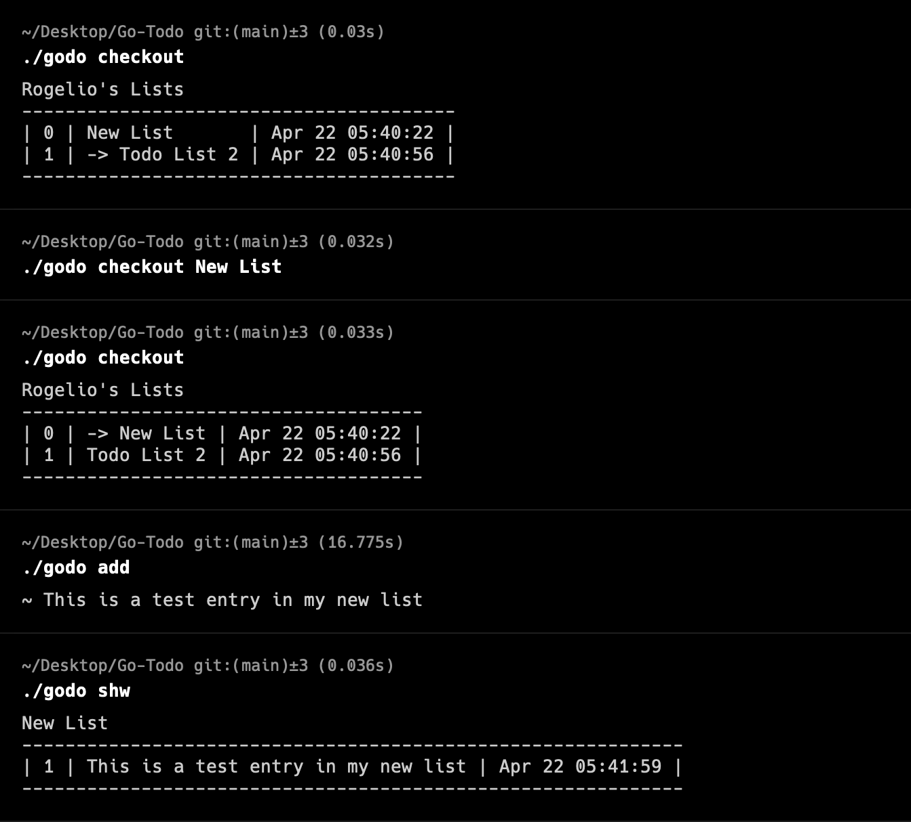

# Go Todo CLI



## Introduction

Go Todo CLI is a simple, yet powerful command-line interface (CLI) application written in Go, designed to help you manage your daily tasks efficiently. This project aims to provide a straightforward and user-friendly way to add, delete, and view tasks on multipple lists from your command line.

## Features

- **Add Task**: Easily add new tasks to your todo list with `./godo add [-i] <task description>`.
- **Delete Task**: Remove tasks from your list using `./godo del`.
- **Show List**: View all your tasks with `./godo shw [specific #]`.
- **Order List**: Order the list by importance `./godo ordr`.
- **Change Username**: Change the name displayed on the list `./godo usr <New Name>`.

## Getting Started

### Prerequisites

- Go 1.16 or later installed on your system. You can check your Go version by running `go version`.

### Installation

1. Clone the repository:
   ```
   git clone https://github.com/rogelio-lopez/go-todo.git
   ```
2. Navigate to the project directory:
   ```
   cd go-todo
   ```
3. Build the application using Makefile (included):
   ```
   make build  
   ```

### Usage
- Change the name of the Database
 ```
 ./godo db-name
 ```
- Create a new list or switch to another list
 ```
 ./godo checkout [existing list/new list name]
 ```
- Delete a list
 ```
 ./godo checkout -d [list name]
 ```
- To add a new task:
 ```
 ./godo add Buy groceries
 ```
- To an important task:
 ```
 ./godo add -i Very important task to do
 ```
- To delete first task:
 ```
 ./godo del
 ```
- To delete a specific task number:
 ```
 ./godo del 2
 ```
- To view all tasks:
 ```
 ./godo shw
 ```
- To order tasks by importance:
 ```
 ./godo ordr
 ```

## Contributing

Contributions are welcome! Please feel free to submit a pull request or open an issue for any feature requests, bugs, or improvements.
